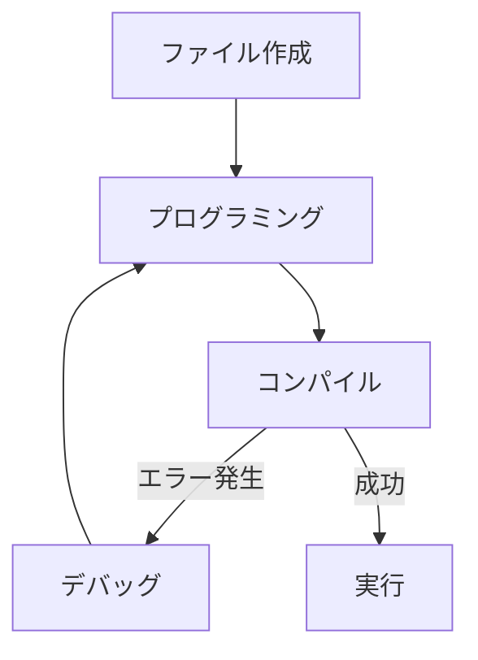

# C言語講習会 Day 1
## プログラミングの基本と環境構築

講習会の概要から始まり、プログラミングとは何かを学び、  
最後にC言語を書いて動かすための「環境構築」を行います。

<div class="pt-12">
  <span @click="$slidev.nav.next" class="px-2 py-1 rounded cursor-pointer" hover="bg-white bg-opacity-10">
    はじめる <carbon:arrow-right class="inline"/>
  </span>
</div>

---

# 本日のアジェンダ

1. **講習会の概要説明**
2. **プログラミングの基本**
3. **プログラムの作り方**
4. **環境構築とHello World**


---

# 1. 講習会の概要説明

### 講習会について
C言語を使って**プログラミングに入門**します。  
C言語を通じて、コンピューターの原理についても少し習得します。  
（※分かりやすさ重視のため、内容を一部端折っている部分があります。）

### 資料について
基本的にWeb上にデプロイする予定です（未定）。

---

# 講習会の進め方

以下のサイクルで進めていきます。

1. 講習会を受ける
2. 課題をやる
3. 次の講習会を受ける
4. 1～3を繰り返す  

初心者の方は**課題をやることを強く推奨**します！（プログラミングの理解に最適です）  
自信がある方は課題をやらなくてもOKです。

---

# 講習会の内容

カリキュラムは後ほど発表します。  
（まだどれぐらいの深度でやるか未定です！）

---

# 2. プログラミングの基本

### プログラミングとは？
コンピュータに「何をしてほしいか」を指示するための手順書（プログラム）を作ることです。

### 何ができるか
- Webサイトやアプリの作成
- ロボットの制御
- ゲーム開発
- AIの開発 ...など、アイデア次第で無限大！

---

# コンピュータと歴史

### コンピュータが理解できる言葉
コンピュータは「0と1」の機械語しか理解できません。  
自然言語（日本語など）では指示できないため、「プログラミング言語」という架け橋を使います。

### 歴史（超ざっくり）
- **機械語手書き**: 0と1をひたすら入力する地獄の時代
- **アセンブリ言語**: 機械語を少し人間にわかりやすくした
- **新たな言語の誕生**: FortranやLispなど、人間がより書きやすい高級言語が登場
- そして **C言語** の誕生！  
（※めっちゃ端折ってる、気になる人は調べて）

---

# マインドセット（超重要！）

プログラミングを学ぶ上で大切にしたい心構えです。

1. **コンピュータは指示された通りにしか動かない**  
   空気を読んだり「いい感じに」やってくれたりはしません。

2. **エラーが出ても凹まない**  
   エラーは「ここが間違ってるよ」と教えてくれるありがたいものです。感謝しろ！

3. **わからないところは自分で調べろ、わからなかったら聞け**  
   ググる力も大事なスキル。それでもダメなら先輩を頼りましょう。  

4. **とりあえず色々試せ**  
   PCが爆発することはそうそうないので、コードをいじって実験しましょう！

---

# 3. プログラムの作り方

### 必要なもの
1. **コード**（人間が書いたプログラム）
2. **コンパイラ**
- コンパイラは、コードをコンピュータが理解できる機械語に翻訳してプログラムを作ってくれます
  - この工程をコンパイルと呼びます
- 世の中には色々なコンパイラがあります
  - GCC
  - Clang
  - MSVC
  - etc...

---

# プログラムができるまで

<div class="grid grid-cols-2 gap-4">
<div>

1. ファイル作成
2. プログラミング（コードを書く）
3. コンパイル
4. 実行

途中でエラーが出たら**デバッグ**（修正）して再コンパイルします。
</div>
<div>



</div>
</div>

---

# 4. ターミナルとコマンド

ここからは環境構築です！
C言語の開発では、主に **ターミナル** を使います。
マウスではなく、キーボードからコマンド（命令）を打ち込んで操作します。

- **Windows**: PowerShell, コマンドプロンプト, WSL (Ubuntu)
- **Mac**: ターミナル (Terminal.app)

今回はターミナル上でエディタを起動し、コンパイルも行います。

---

# 環境構築 (Windows)

Windowsでは **WSL (Windows Subsystem for Linux)** の導入を推奨します。
Windowsの中にLinux環境を作ることで、標準的なC言語の開発がしやすくなります。

1. スタートメニューを右クリック → 「Windows PowerShell (管理者)」を開く
2. `wsl --install` を実行し、完了したらPCを**再起動**する
3. 再起動後、スタートメニューから「**Ubuntu**」を検索して起動する
4. 初回起動の処理が終わるまで数分待つ
5. 画面の指示に従い、Linux用のユーザー名とパスワードを設定する
   - ※パスワード入力時は画面に文字が表示されないので注意
6. 以下のコマンドでCコンパイラをインストールする
   ```sh
   sudo apt update
   sudo apt install build-essential
   ```

---

# 環境構築 (Windows - MinGWの場合)

WSLを利用しない・できない場合は、**MinGW-w64** をインストールしてWindows上で直接コンパイルすることも可能です。

1. [MSYS2](https://www.msys2.org/) のインストーラをダウンロードし、実行
2. インストール完了後、MSYS2のターミナルが開くので以下を実行
   ```sh
   pacman -S mingw-w64-ucrt-x86_64-gcc
   ```
3. `C:\msys64\ucrt64\bin` を環境変数（Path）に追加する
4. コマンドプロンプト等を開き直して確認
   ```sh
   gcc --version
   ```

※ただし、この講習会では基本的にWSLの利用を前提として解説を進めます。

---

# 環境構築 (Mac)

Macには標準で開発ツールをインストールする機能が備わっています。

1. 「ターミナル」アプリを開く（Spotlight検索で「ターミナル」と入力）
2. 以下のコマンドを実行する
   ```sh
   xcode-select --install
   ```
3. 画面の指示に従って「インストール」をクリック
4. インストール完了後、以下のコマンドで確認
   ```sh
   gcc --version
   ```

※すでにインストール済みの場合はエラーが出ますが、問題ありません。

---

# 環境構築 (その他のOS)

### Linux (Ubuntu, Arch, Nix 等) をネイティブでお使いの皆様へ
**ご自身でなんとかしてください。**  
（おそらく既に自力で環境構築できる猛者だと信じています。パッケージマネージャーで `gcc` を入れてね！）

### ChromeOS, Android, その他謎のOS をお使いの皆様へ
**サポート対象外です（知らん）。**  
気合いで乗り切るか、WindowsかMacのPCを調達してきてください。

---

# エディタの準備

プログラムを書くための「エディタ」を用意します。
本講習会ではターミナル上で動く最強のエディタ、 **Vim** を**強く推奨**します！

<div class="grid grid-cols-2 gap-4 mt-4 text-left">
<div>

### Vim
- ほとんどの環境に標準で入っている
- **キーボードから手を離さずに爆速で操作可能**
- `i` で入力モード、`Esc` でコマンドモード
- 最強のカスタマイズ性
- 使えるようになるとカッコいい
- 使いこなせるとモテる(ガチ)


起動: `vim hello.c`
</div>
<div>

### Emacs（非推奨）
- Lispを書く時にしか使いません
- 指がつりそうになる独特のショートカットキー
- チュートリアルの時点で3人に2人が離脱
- Vimmerを見下すようになる
- **※本講習会ではVimの利用を前提に進めます。**

起動: `emacs hello.c` (推奨しません)
</div>
</div>

---

# Hello World (1/2)

実際にC言語のプログラムを書いてみましょう。
ターミナルを開き、エディタで `hello.c` というファイルを作成します。

```c
#include <stdio.h>

int main(void) {
    printf("Hello, World!\n");
    return 0;
}
```

入力が終わったら、保存してエディタを終了します。
- Vim: `Esc` を押して `:wq` と入力し `Enter`（これだけ覚えればOK！）
- Emacs: `Ctrl-x` のあとに `Ctrl-s` で保存、`Ctrl-x` のあとに `Ctrl-c` で終了（ね、面倒でしょ？）

---

# Hello World (2/2)

書いたプログラムを**コンパイル**（コンピュータが実行できる形式に変換）し、実行します。

### コンパイル
以下のコマンドを実行します。
```sh
gcc hello.c -o hello
```
成功すると、同じフォルダに `hello` というファイルが作成されます。

### 実行
作成されたファイルを実行します。
```sh
./hello
```

画面に `Hello, World!` と表示されれば成功です！

---

# 次回予定

- お疲れ様でした
- 今回は課題はありません

次回はC言語の基本をやります
 - プログラムの詳解、コンパイルコマンドの解説、型 etc...