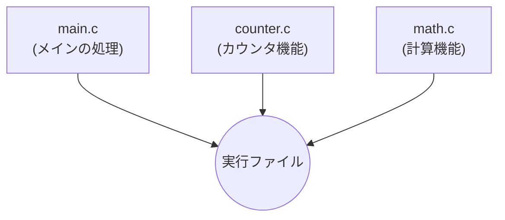
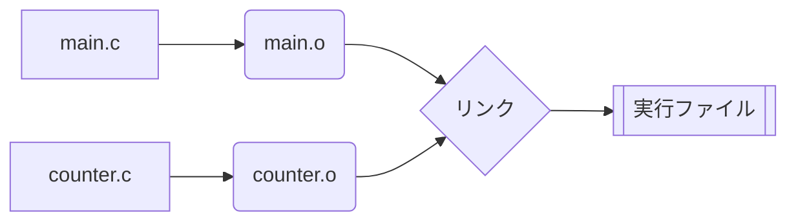

# C言語講習会 Day 10
## 分割コンパイルとビルド自動化

いよいよ実践的なプログラム開発の知識です！  
複数のファイルに分けてコードを書く **「分割コンパイル」** と  
コンパイル作業を自動化する **「make」** について学びます。  

<div class="pt-12">
  <span @click="$slidev.nav.next" class="px-2 py-1 rounded cursor-pointer" hover="bg-white bg-opacity-10">
    はじめる <carbon:arrow-right class="inline"/>
  </span>
</div>

---

# 今回やること

1. **分割コンパイルとは**
2. **オブジェクトファイル (`.o`) を作る**
3. **プロトタイプ宣言と Warning**
4. **ヘッダーファイル (`.h`)**
5. **大域変数と `extern`**
6. **インクルードガード** (`#ifndef`, `#pragma once`)
7. **`make` の活用と `Makefile`**
8. **本日の演習課題**

---

# 分割コンパイルとは

1つのプログラム（実行ファイル）を作るために、**複数のソースファイル（`.c`）に分けて開発し  
それぞれをコンパイルすること** を分割コンパイルと呼びます。

<div class="grid grid-cols-[1fr_1fr] gap-6 mt-4 text-left">
<div>

### なぜ分けるの？
- **見通しが良くなる**  
  数千行のコードを1つの `main.c` に書くと、どこに何があるか分からなくなります。
- **コンパイル時間が短くなる**  
  変更があったファイルだけを再コンパイルすればよくなるため、大規模な開発で時間を節約できます。
- **再利用がしやすい**  
  便利な機能（数学関数など）を別のファイルに切り出しておけば、他のプロジェクトでも使い回せます。

</div>
<div>



<div class="text-sm text-gray-600 mt-2">
役割ごとにファイルを分けるのが一般的です。
</div>

</div>
</div>

---

# 分割コンパイルの手順 (オブジェクトファイル)

分割コンパイルでは、ソースファイル（`.c`）をいきなり実行ファイルにするのではなく、一度 **「オブジェクトファイル（`.o`）」** という部品に変換します。

<div class="grid grid-cols-[1fr_1fr] gap-6 mt-4 text-left">
<div>

### 1. オブジェクトファイルの作成
`-c` オプションをつけると、実行ファイルを作らずにコンパイルだけを行い、`.o` ファイルを作成します。  

`$ gcc -c main.c`  
`$ gcc -c counter.c`  
（これにより `main.o` と `counter.o` ができる）

### 2. リンク（結合）
できた `.o` ファイルをすべて繋ぎ合わせて（リンクして）、1つの実行ファイルを作ります。  

`$ gcc main.o counter.o -o my_program`

</div>
<div>



</div>
</div>

---

# プロトタイプ宣言と Warning

別ファイル（`counter.c`）に書かれた関数を `main.c` から呼び出そうとすると、コンパイル時に以下のような **Warning（警告）** が出ることがあります。

<div class="bg-gray-800 text-white p-2 rounded text-sm text-left mt-2 overflow-x-auto">
<pre><code>main.c:19:17: warning: implicit declaration of function 'increment'
   19 |     increment();
      |     ^~~~~~~~~</code></pre>
</div>

<div class="grid grid-cols-[1fr_1fr] gap-6 mt-4 text-left">
<div>

### 暗黙の宣言 (Implicit declaration)
C言語では、関数の「実体」が別のファイルにあっても、事前に「こんな関数があるよ」と教えてあげないとコンパイラが困ってしまいます。

</div>
<div>

### プロトタイプ宣言で解決
使うファイルの先頭で、関数の名前と型だけを宣言しておきましょう。
```c
// main.c の先頭に書く
void increment(void);
void decrement(void);
```

</div>
</div>

---

# ヘッダーファイル (`.h`) の登場

プロトタイプ宣言を書けば Warning は消えますが、関数を使うすべての `.c` ファイルの先頭にいちいちプロトタイプ宣言を書くのは **非常に面倒** です。

<div class="grid grid-cols-[1fr_1fr] gap-6 mt-4 text-left">
<div>

### ヘッダーファイルとは？
共通で使いたい「プロトタイプ宣言」や「構造体の定義」などを一つにまとめたファイルです。拡張子は `.h` になります。

このヘッダーファイルを、使いたい `.c` ファイルから `#include` で読み込みます。

</div>
<div>

```c
// counter.h (ヘッダーファイル)
void increment(void);
void decrement(void);
```

```c
// main.c
#include <stdio.h>
// 自作のヘッダは "" で囲む！
#include "counter.h" 

int main(void) {
    increment(); // Warningが出ない！
}
```

</div>
</div>

---

# 大域変数 (グローバル変数) と `extern`

どの関数の中にも入っていない、ファイルの一番外側に定義された変数を **大域変数（グローバル変数）** と呼びます。  
プログラム全体で共有される変数ですが、扱いには注意が必要です。

<div class="grid grid-cols-[1fr_1fr] gap-6 mt-4 text-left">
<div>

### `extern` 宣言
あるファイルで作られた大域変数を **別のファイルでも使いたい場合** は、`extern`（エクスターン）をつけて宣言する必要があります。

「実体は別のどこかにあるけど、この変数を使わせてね」という意味になります。

</div>
<div>

```c
// counter.c (変数の実体)
int count = 0; // 大域変数
```

```c
// counter.h または main.c
// 「どこかにある count を使うよ」という宣言
extern int count; 
```

<div class="p-2 bg-yellow-100 dark:bg-yellow-900 rounded text-xs mt-2 font-bold">
⚠️ 大域変数はどこからでも書き換えられるため、バグの原因になりやすいです。必要最小限にとどめましょう。
</div>

</div>
</div>

---

# インクルードガード

ヘッダーファイルが複雑になってくると、「AのヘッダーがBを読み込み、BがAを読み込む」といった **多重インクルード** が発生し、構造体などが「二重定義」されてエラーになることがあります。これを防ぐのが **インクルードガード** です。

<div class="grid grid-cols-[1fr_1fr] gap-4 mt-4 text-left">
<div>

### 現代的な書き方 (`#pragma once`)
一番先頭にこれを書くだけで、コンパイラが「このファイルは1回しか読み込まない」ようにしてくれます。（※ただし、ごく一部の古いコンパイラでは使えません）

```c
#pragma once

extern int count;
void increment(void);
```

</div>
<div>

### 伝統的な書き方 (`ifndef`)
昔からある確実な方法です。「もしマクロが定義されていなければ、定義して中身を読み込む」という仕組みです。

```c
#ifndef COUNTER_H
#define COUNTER_H

extern int count;
void increment(void);

#endif
```

</div>
</div>

---

# `make` の概要

分割コンパイルでファイルが増えると、コンパイルのコマンドを毎回手打ちするのは大変ですよね？  
`$ gcc -c main.c`  
`$ gcc -c counter.c`  
`$ gcc main.o counter.o -o my_app` ... 打つのが面倒！

<div class="grid grid-cols-[1fr_1fr] gap-6 mt-4 text-left">
<div>

### ビルドの自動化ツール `make`
この一連のコンパイル（ビルド）作業を自動化してくれるのが `make` コマンドです。  

`Makefile` (メイクファイル) という設計図を作っておけば、ターミナルで `make` と打つだけで、必要なコマンドを自動で順番に実行してくれます！

</div>
<div>

<div class="p-4 bg-gray-100 dark:bg-gray-800 rounded">
<b>【 make の賢いところ 】</b><br>
すべてのファイルを再コンパイルするのではなく、ファイルの「最終更新日時」を見て、<b>「書き換えられたファイルだけ」</b>を再コンパイルしてくれるため、非常に高速です。
</div>

</div>
</div>

---

# `Makefile` の書き方

`Makefile` という名前のテキストファイルを作成し、**「何から何を作るか」**のルール（構文）を記述します。

<div class="grid grid-cols-[1fr_1fr] gap-6 mt-4 text-left">
<div>

### 基本的な構文
```makefile
ターゲット: 依存するファイル群
	実行するコマンド
```

<div class="text-sm mt-4 text-red-600 dark:text-red-400 font-bold">
🚨 重要な注意点
</div>
「実行するコマンド」の行の先頭は、スペースではなく **必ず「Tab (タブ) 文字」** でインデントしなければなりません！スペースだとエラーになります。

</div>
<div>

### 実際の Makefile の例

```makefile
# 最終目的 (main) は main.o と counter.o から作る
main: main.o counter.o
	gcc main.o counter.o -o main

# main.o は main.c から作る
main.o: main.c
	gcc -c main.c

# counter.o は counter.c から作る
counter.o: counter.c
	gcc -c counter.c
```

ターミナルで `make` または `make main` と打つと実行されます！

</div>
</div>

---

# 第十回の課題

本日はプログラミングの演習というより、**ビルド環境の構築** の演習です！  
（※今回はスライド上の課題です。手元のエディタとターミナルで実行してください）

### 課題: 分割コンパイルと自動化を体験せよ

1. `main.c`, `counter.c`, `counter.h` の3つのファイルを作成し、講義内で紹介した「カウンタ機能」を分割して実装してください。（内容は自由ですが、`increment()` などの関数を作って `main.c` から呼び出してください）
2. `gcc` コマンドを手打ちして、オブジェクトファイルの作成（`-c`）からリンクまでを行い、実行できることを確認してください。
3. `Makefile` を作成し、ターミナルで `make` と打つだけでビルドが完了するように自動化してください。
4. （確認）`counter.c` だけを書き換えて `make` を実行したとき、`main.c` のコンパイルはスキップされる（`counter.c` のみがコンパイルされる）ことを確認してください。

---

# 次回予定

いよいよ講習会も最終回（Day 11）を迎えます！  
最後は、C言語を使って「ファイル」を読み書きする方法を学び、これまでの知識を総動員する総合演習を行います。

- **ファイル入出力の基礎** (`fopen`, `fclose`)
- **テキストファイルの読み書き** (`fprintf`, `fscanf`)
- **総合演習** (ファイル保存機能つきのツールなど)
