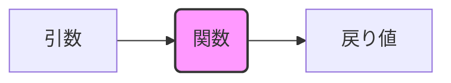

# C言語講習会 Day 2
## C言語の基本構文と「おまじない」の解剖

Day 1で書いた Hello, World! のプログラム。<br>
実はあの数行の中に、C言語の超重要なルールが詰まっています。<br>
今日はその「おまじない」の意味を、コードの上から順番に解き明かしていきます！

<div class="pt-12">
  <span @click="$slidev.nav.next" class="px-2 py-1 rounded cursor-pointer" hover="bg-white bg-opacity-10">
    はじめる <carbon:arrow-right class="inline"/>
  </span>
</div>

---

# 本日のアジェンダ

1. **Hello, World! とコンパイルの復習**
2. **一番上の行** (`#include <stdio.h>`)
3. **関数のイメージと `main` 関数**
4. **プログラムの基本構造** (`{ }`, インデント)
5. **命令の実行** (`printf` と `;`)
6. **終了の合図** (`return` と型の概念)
7. **本日の課題**

---

# 1. Hello, World! の復習

Day 1で書いたコードをもう一度見てみましょう。

```c
#include <stdio.h>

int main(void) {
    printf("Hello, World!\n");
    return 0;
}
```

たったこれだけの行数ですが、C言語を動かすための**必須要素**が全て含まれています。  
今日はこのコードを上から1行ずつ解剖していきましょう

---

# コンパイルコマンドの復習

プログラムを書いたら、コンピュータが理解できる言葉（機械語）に翻訳する必要があります。  
これを**コンパイル**と呼びます。

```sh
# hello.c をコンパイルして、hello という実行ファイルを作る
gcc hello.c -o hello
```

- `gcc` : Cコンパイラの名前（翻訳機）
- `hello.c` : 翻訳してほしいソースコード。スペース区切りで複数ファイルを指定することも可能です  
（例: `gcc a.c b.c`）
- `-o hello` : 出力する（**o**utput）  
実行ファイルの名前を `hello` に指定するという意味です。
  - ※ Windowsでは `hello.exe` のように `.exe` という拡張子が付きますが、  
  LinuxやMacでは実行ファイルに拡張子がつかないのが一般的です。

実行するときは `./hello` と打ち込みます。

---

# 2. `#include`について

<div class="grid grid-cols-[2fr_3fr] gap-6 mt-4 text-left">
<div>

```c {1}
#include <stdio.h>

int main(void) {
    printf("Hello, World!\n");
    return 0;
}
```

</div>
<div>

### #include <stdio.h>
- `stdio.h`というヘッダーファイルを読み込め！という指示
- `< >`で囲まれたファイルを読み込む
- C言語の様々な機能を使用するには、**ヘッダーファイル**を読み込む必要がある
 - 拡張子は`.h`
- **`#`** : ここから始まる命令を **プリプロセッサ命令** と呼ぶ  
<br>

### stdio とは？
- **<span class="text-blue-600">std</span><span class="text-red-500">i</span><span class="text-green-600">o</span>.h**: <span class="text-blue-600 font-bold">St</span>an<span class="text-blue-600 font-bold">d</span>ard <span class="text-red-500 font-bold">I</span>nput / <span class="text-green-600 font-bold">O</span>utput
- 標準入出力の略，printf関数はstdio.hの中に定義されている

</div>
</div>

---

# 3. 関数の基礎イメージ

次に `main` の話に入りますが、その前に「関数」という言葉について  

C言語における「関数」とは、数学の関数 $y = f(x)$ と同じく  
**「何かを入れたら、中で処理をして、何かを出してくれる箱」** のこと

<div class="grid grid-cols-2 gap-4 mt-8 text-left">
<div>

- **引数 (ひきすう)**: 関数に渡すデータ
- **処理**: 中で行われる動作
- **戻り値 (もどりち)**: 関数が返してくれるデータ  
<br>
**数学的な関数の定義**：
- 2つの変数 $x, y$ があって，$x$ の値を決めると，  
それに対応して$y$ の値がただ1つ決まるとき，  
$y$ は $x$ の関数であるという．
</div>
<div>



</div>
</div>

※自分で関数を作る方法はDay 7でやります。今は「そういう箱がある」というイメージでOK

---

# 関数宣言について

<div class="grid grid-cols-[2fr_3fr] gap-6 mt-4 text-left">
<div>

<div class="relative">

```c
#include <stdio.h>

int main(void) {
    printf("Hello, World!\n");
    return 0;
}
```
  <!-- 強引に枠線を重ねるハック（ズレる場合は top や height を調整してください） -->
  <div class="absolute border-2 border-yellow-500 pointer-events-none" style="top: 3.8rem; left: 1rem; width: 85%; height: 2.3rem;">
    <span class="absolute -bottom-6 right-0 text-yellow-500 font-bold text-sm">関数の処理</span>
  </div>
</div>

</div>
<div>

### 関数の表記ルール
- **型 (`int`)**: 戻り値の種類（整数、文字など）を示す  
詳しい説明は後述
- **引数 (`void`)**: その関数に渡す値のこと
  - 今回は「何も渡さない」ため `void` を指定している
  - 複数ある場合はカンマ (`,`) で区切って書く
- **関数の処理**: `{ }` で囲まれたところに書く
  - 左のコードのオレンジ色で囲まれた部分  
<br>
### `main` 関数の特別ルール
- C言語において `main` 関数は特別な関数であり  
**プログラムのはじめに呼び出される**というルールがある

</div>
</div>

---

# 4. プログラムの基本構造 (ブロックとインデント)

<div class="grid grid-cols-[2fr_3fr] gap-6 mt-4 text-left">
<div>

```c {3,6}
#include <stdio.h>

int main(void) {
    printf("Hello, World!\n");
    return 0;
}
```

</div>
<div>

### `{ }` 中括弧 とブロック
- `{` から `}` までが、1つの処理のまとまり(**ブロック**)を表す
- 今回は `main` 関数の中身全体を囲っている  
<br>
### インデント (字下げ)
- ブロックの中身は、行の先頭に空白(spaceやtab)を入れる
- これを **インデント** と呼ぶ
- **人間が読みやすくするため**に絶対に必要！  
（汚いコードは怒られます）

</div>
</div>

---

# 5. 命令の実行 (関数の呼び出しとセミコロン)

<div class="grid grid-cols-[2fr_3fr] gap-6 mt-4 text-left">
<div>

```c {4}
#include <stdio.h>

int main(void) {
    printf("Hello, World!\n");
    return 0;
}
```

</div>
<div>

### 関数の呼び出し方
- `関数名(引数)` の形で書くことでその関数を使う（呼び出す）ことができる
- ここでは `stdio.h` に入っている **`printf` 関数** を呼び出している
- カッコ `( )` の中身が、関数に渡すデータ（**引数**）となる  
<br>

### セミコロン (`;`) の超重要ルール
- 一つの命令の終わりには**必ず `;` をつける！**
- セミコロンは命令の終端を意味する。  
これがないとコンパイル時に構文エラーになる
- ただし、プリプロセッサ命令（`#`で始まる行）については  
セミコロンを付けては**いけない**

</div>
</div>

---

# 5. 命令の実行 (`printf` の中身)

<div class="grid grid-cols-[2fr_3fr] gap-6 mt-4 text-left">
<div>

```c {4}
#include <stdio.h>

int main(void) {
    printf("Hello, World!\n");
    return 0;
}
```

</div>
<div>

### 標準出力への表示
- `printf` は、指定した文字列を **標準出力** に出力する関数
- 今は「標準出力 ＝ ターミナル画面」という認識でOK  
<br>

### 文字列のルール
- C言語において、文字列は必ず **ダブルクォーテーション (`"`)** で囲む
- 「`Hello, World!\n` を出力してね！」と命令している  
<br>

### 改行文字 (`\n`)
- 文字列の最後にある `\n` (環境によっては `¥n`) は   
**改行** を意味する
- `\n` がないと出力後に改行されず  
文字が横に詰まってしまうので注意すること

</div>
</div>

---

# 6. 終了の合図 (`return` の役割)

<div class="grid grid-cols-[2fr_3fr] gap-6 mt-4 text-left">
<div>

```c {5}
#include <stdio.h>

int main(void) {
    printf("Hello, World!\n");
    return 0;
}
```

</div>
<div>

### `return` 命令
- 関数を終了し、呼び出し元に値を返す命令
- 呼び出し元に返す値のことを **戻り値** と呼ぶ
- `return 0;` は「無事終了しました」とOSに `0` という整数を返している
- ※ C言語の制約上、関数が一度に返せる値は **1つまで**
  - 複数の値を返す技もある

</div>
</div>

---

# 6. 終了の合図 (なぜ 0 なのか？)

<div class="grid grid-cols-[2fr_3fr] gap-6 mt-4 text-left">
<div>

```c {5}
#include <stdio.h>

int main(void) {
    printf("Hello, World!\n");
    return 0;
}
```

</div>
<div>

### 型の概念
- なぜ文字列や小数ではなく `0` なのか？
- 関数の宣言時に `int` を指定しているため、必ず **整数** を返す必要があるから！
- C言語のデータには様々な種類（型）がある  
次のスライドで全体像を見てみよう

</div>
</div>

---

# C言語の主なデータ型一覧

C言語には、扱うデータの種類に応じて様々な「型」が用意されている

<div class="text-sm mt-2">

| 型名 | 意味 | 具体例・備考 |
| :--- | :--- | :--- |
| **`int`** | 整数 | `0`, `1`, `2` |
| **`float`** | 浮動小数点 (小数) | `1.0f`, `6.3f` (数値の後ろに `f` をつける) |
| **`double`** | 倍精度浮動小数点 | `3.1415` (通常の小数にはこれを使う) |
| **`char`** | 文字 | `'a'`, `'b'` (ASCIIのみ。シングルクォーテーションで囲む) |
| **`char*`** | 文字列 | `"あいう"` (厳密には異なるが、今はこれでOK) |
| **`void`** | 空 (から) | データがないことを示す |
| **`struct`** | 構造体 | (略) 後日の講義で解説する |
| **`union`** | 共用体 | (略) 本講習会では扱わない |
| **`enum`** | 列挙体 | (略) 本講習会では扱わない |

<div class="mt-2 text-gray-500">
※ 型ごとに使用するメモリ量が異なります（詳細はDay3以降で！）<br>
※ この時点ですべて覚える必要はありません。「こんなに種類があるんだな」くらいでOKです！
</div>

</div>

<style>
th, td {
  padding-top: 0.1rem !important;
  padding-bottom: 0.1rem !important;
}
table {
  margin-top: 0.5rem !important;
  margin-bottom: 0.5rem !important;
}
</style>

---

# 7. 本日の課題

### 課題1
以下の要件を満たすC言語のプログラムを作成せよ

1. ファイル名は `profile.c` とすること
2. 実行すると、自分の名前と年齢が改行されて表示されること

**実行結果のイメージ:**
```bash
$ ./profile
名前: 高専 太郎
年齢: 18歳
```

※まだ年齢を変数として扱う方法は習っていないので  
今回は単純に `printf` を使って文字として表示するだけで構わない  
もし既に習得済みであれば変数を使っても構わない

---

# 7. 本日の課題

### 課題2
課題1で作成した`profile.c`を以下のように変更せよ

- 年齢の表示を`printf`関数の書式付き文字列機能を用いて実現せよ

<details class="mt-2 p-2 bg-gray-100 dark:bg-gray-800 rounded shadow-sm border border-gray-200 dark:border-gray-700 text-sm">
  <summary class="cursor-pointer text-green-600 dark:text-green-400 select-none outline-none">
    💡 ヒントを見る (クリックで展開)
  </summary>

<div class="mt-2 pl-4 text-gray-700 dark:text-gray-300">

`%d`の部分に数値を埋め込むには、文字列の後にカンマ `,` を打って数値を渡す  
`"年齢: %d歳\n"` の `%d` に自分の年齢の数値を渡す

<details class="mt-3 p-2 bg-white dark:bg-gray-900 rounded border border-gray-300 dark:border-gray-600">
  <summary class="cursor-pointer text-orange-600 dark:text-orange-400 select-none outline-none font-bold">
    👀 記述例を見る
  </summary>

<div class="mt-2 pl-2">

**例:** `printf("ラッキーナンバー: %d\n", 7);`

</div>
</details>

</div>
</details>

**実行結果のイメージ:**
```bash
$ ./profile
名前: 高専 太郎
年齢: 18歳
```

---

# 次回予定

- 変数(コンピュータに値を覚えてもらう)
- データ型(Day2の深掘り)
- 式と演算子(コンピュータに計算させる)